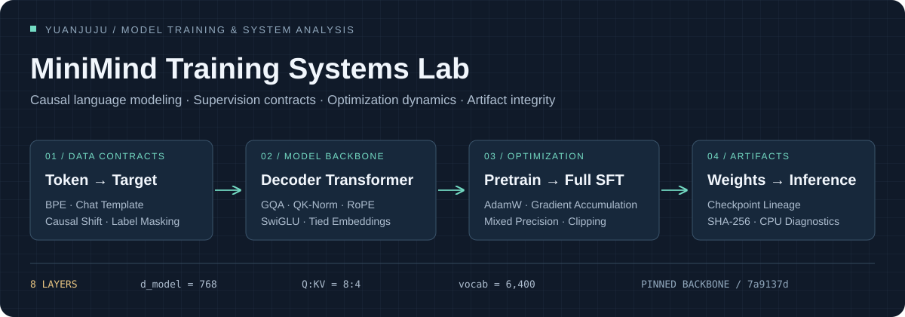
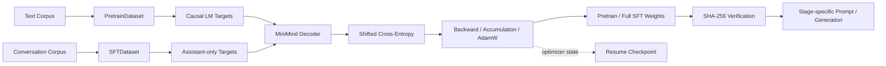

# MiniMind Training Systems Lab

**Causal Language Modeling · Supervision Engineering · Optimization Dynamics · Artifact Verification**

基于 MiniMind 的语言模型训练与机制分析工程，围绕 **数据语义 → 监督信号 → Decoder 计算图 → 优化器状态迁移 → 权重交付 → 推理协议** 构建实验链路。已在 RTX 4090 上完成预训练与 Full SFT，并在 Mac 上完成权重校验与推理验证；仓库同时提供可运行的 CPU 诊断、参数结构审计和分阶段技术文档。



[系统分析](docs/training-systems.md) · [训练记录](docs/reproduction.md) · [诊断报告](docs/diagnostics/cpu-baseline.json) · [源码地图](docs/source-map.md) · [技术文章](https://yuanjuju.github.io/posts/minimind-from-pretrain-to-sft/)

## Technical Scope

| 技术域 | 分析与工程实践 | 实现 / 证据 |
| --- | --- | --- |
| **Tokenization & Sequence Protocols** | BPE 编码、特殊 token、Chat Template、阶段相关的 generation prefix | [Tokenizer](learning/inspect_tokenizer.py) · [Prompt protocol](learning/inspect_prompts.py) |
| **Supervision Signal Construction** | Causal shift、padding exclusion、assistant-only masking；追踪输入位置与 loss target 的映射 | [Pretrain targets](learning/inspect_pretrain_labels.py) · [SFT targets](learning/inspect_sft_labels.py) |
| **Decoder Architecture Analysis** | GQA、QK-Norm、RoPE、SwiGLU、Pre-Norm residual、embedding / LM head 参数共享 | [Tensor inspection](learning/inspect_model_shapes.py) · [Parameter census](learning/profile_model.py) |
| **Optimization & Numerical Path** | AdamW、梯度累积、混合精度与 clipping 路径；通过单步实验验证 gradient flow 和参数更新 | [Gradient diagnostic](learning/one_step_training.py) · [训练系统分析](docs/training-systems.md) |
| **Pretraining → Instruction Tuning** | 预训练权重到 Full SFT 的参数继承、目标函数切换、输入协议变化 | [两阶段训练记录](docs/reproduction.md) |
| **Artifact Integrity & Provenance** | 上游提交固定、源码指纹、权重 SHA-256、推理权重与 resume checkpoint 的语义区分 | [来源清单](UPSTREAM_SOURCE.md) · [权重校验器](learning/verify_weights.py) |
| **Experiment Instrumentation** | 子进程隔离、超时控制、退出码、依赖版本与结构化 JSON 报告 | [Diagnostic runner](learning/run_diagnostics.py) · [已运行报告](docs/diagnostics/cpu-baseline.json) |

模型与训练器来自固定的 MiniMind 上游快照；本仓库的工作集中在训练复现、机制诊断、结构审计与实验文档。各技术项对应的实现和验证范围见表内链接。

## Training Pipeline



训练链路与 CPU 诊断共用仓库中的 tokenizer、dataset 和 model 实现。诊断层使用受控样本验证数据、张量和梯度契约；云端训练记录保留实际运行条件与产物清单。

### Supervision Contract

两阶段训练共享 next-token objective，差异主要体现在序列组织与监督掩码。令 `y` 为 dataset 返回的 labels，`m` 表示目标位置是否有效：

```math
\mathcal{L}(\theta)=-\frac{1}{\sum_{b,t}m_{b,t}}\sum_{b,t}m_{b,t}\log p_\theta(x_{b,t+1}\mid x_{b,\le t}),\qquad m_{b,t}=\mathbf{1}[y_{b,t+1}\ne -100]
```

- **Pretraining**：非 padding 的后继 token 参与监督，序列第一个位置经 causal shift 后不计入目标。
- **Full SFT**：用户与助手头部位置被屏蔽，助手内容及匹配的结束序列参与监督；用户内容仍作为注意力上下文。
- **Template semantics**：当前数据路径包含随机 system 注入与空 think 标签处理；CPU 诊断固定随机种子以追踪实际目标位置。

### Optimization Contract

对完整梯度累积窗口，有效 batch 与单次参数更新对应的样本数关系为：

```math
B_{\mathrm{effective}}=B_{\mathrm{micro}}\times N_{\mathrm{accum}}\times N_{\mathrm{workers}}=32\times8\times1=256
```

这里 `N_workers` 指数据并行进程数，不是 DataLoader 的 `num_workers`。上式对应已记录的预训练配置。日志中的 batch step、optimizer update 与 checkpoint step 分开解释；尾部不足一个累积窗口、保存顺序及 resume 状态见[优化器与检查点分析](docs/training-systems.md#optimization-and-checkpoint-semantics)。

## Model Anatomy

以下结果由 [`profile_model.py`](learning/profile_model.py) 在 meta device 上遍历固定版本模型参数生成，统计共享权重时去重。完整配置、源码 SHA-256 与内存公式输入见 [`model-profile.json`](docs/diagnostics/model-profile.json)。

| 组件 | 配置 / 独立参数量 | 分析要点 |
| --- | --- | --- |
| Decoder stack | 8 层 · hidden width 768 · FFN width 2,432 | Pre-Norm、残差路径、SwiGLU |
| Attention | 8 个 Q 头 / 4 个 KV 头 · head dim 96 | Grouped-Query Attention、QK-Norm、RoPE |
| Attention projections | 14,155,776 | Q / K / V / O 投影，norm 单独统计 |
| Feed-forward network | 44,826,624 | Gate / Up / Down 三路投影 |
| Shared embedding / LM head | 4,915,200 | 6,400 词表，共享一份参数 |
| Normalization | 14,592 | Block norms、Q/K norms 与 final norm |
| **Total unique parameters** | **63,912,192** | 来自模型结构枚举；与训练日志 `63.91M` 一致 |

对每个序列，采用 2-byte 元素存储的 K/V 张量净载荷为：

```math
M_{\mathrm{KV}}=2LTH_{\mathrm{KV}}d_{\mathrm{head}}s=2\times8\times T\times4\times96\times2=12\,\mathrm{KiB}\times T
```

这是结构推导：`T=2048` 时为 **24 MiB / sequence**，不包括权重、激活、`repeat_kv` 临时展开或分配器开销，也不代表该上下文长度已完成质量验证。

## Experiment Record

| 阶段 | 已保留的事实 | 产物 |
| --- | --- | --- |
| **Pretraining** | RTX 4090；1 epoch；39,695 个数据加载步；末次记录 loss ≈ 2.0066 | `pretrain_768.pth` · [训练命令与记录](docs/reproduction.md) |
| **Full SFT** | 基于预训练权重；1 epoch；56,608 个数据加载步；batch size 16 | `full_sft_768.pth` · [SHA-256 清单](docs/artifacts.sha256) |
| **Local verification** | 历史记录：Mac CPU 推理与两份权重完整性校验 | [校验脚本](learning/verify_weights.py) |
| **Mechanism diagnostics** | 7 个检查项：tokenizer、两类监督、张量形状、梯度更新、prompt、参数审计 | [版本化 CPU 报告](docs/diagnostics/cpu-baseline.json) |

训练 loss 是日志中的训练目标值。完整 SFT 启动命令、验证集评分与多随机种子结果未保留；因此现有记录用于说明训练执行和产物来源。系统化质量评测列为后续实验，CPU 机制诊断中的随机模型输出不作为正式模型成绩。

## Run the Diagnostics

在仓库根目录创建独立环境，运行统一检查入口：

```bash
python3.12 -m venv .venv
./.venv/bin/python -m pip install -r requirements-learning.txt
./.venv/bin/python learning/run_diagnostics.py
```

默认报告写入 `.cache/diagnostics/latest.json`，记录依赖版本、输入文件 SHA-256、各实验输出与退出码。诊断使用本地 tokenizer、受控样本与临时模型，不读写正式训练权重。模型审计采用 meta tensors，仅检查结构与参数规模。

```bash
# 导出结构审计；KV 字节数为解析估算
./.venv/bin/python learning/profile_model.py --output .cache/diagnostics/model-profile.json

# 校验自己的正式产物
./.venv/bin/python learning/verify_weights.py --weights-dir /path/to/weights
```

已有 Conda 时也可用 `conda create -y --prefix ./.venv python=3.12` 创建环境。上面是 CPU 诊断依赖；正式训练的依赖与数据入口见 [上游文档](README.upstream.md) 和 [复现记录](docs/reproduction.md)。

## Technical Documentation

| 入口 | 内容 |
| --- | --- |
| [Training Systems Analysis](docs/training-systems.md) | 监督契约、注意力结构、数值路径、checkpoint 语义与诊断设计 |
| [Source Map](docs/source-map.md) | dataset → decoder → trainer → generation 的实现定位 |
| [Reproduction Record](docs/reproduction.md) | 个人云端训练条件、已保存命令与产物指纹 |
| [Mechanism Labs](learning/README.md) | 可独立运行的 CPU 机制实验 |
| [Study Modules](guide/00-start.md) | Tokenization、Transformer、训练与推理的分阶段笔记 |
| [Evaluation Plan](docs/learning-path.md) | 预训练 / SFT 固定条件对照与后续评测计划 |

**Extension tracks**：LoRA、DPO、MoE 与 RL 训练路径可在保留的上游源码和[扩展笔记](guide/04-next-topics.md)中查阅；其训练实验尚未纳入本仓库的已完成结果。

## Attribution & License

基于 [jingyaogong/minimind](https://github.com/jingyaogong/minimind) 的固定提交 [`7a9137d`](UPSTREAM_SOURCE.md)。`model/`、`dataset/`、`trainer/`、`scripts/` 等基础实现归属上游；新增诊断工具、学习文档和个人复现记录位于 `learning/`、`guide/`、`docs/`。保留 [原始中文 README](README.upstream.md)、[原始英文 README](README_en.md) 与 [Apache-2.0 LICENSE](LICENSE)。
