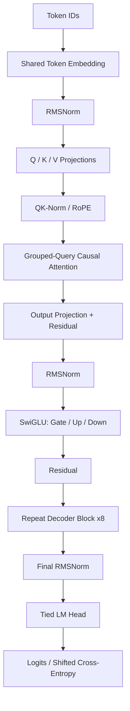

# Training Systems Analysis

本文对应仓库固定的 MiniMind 实现，分析范围为 Dense 训练路径。模型和训练器的实现归属见 [UPSTREAM_SOURCE.md](../UPSTREAM_SOURCE.md)；运行过的训练条件见 [reproduction.md](reproduction.md)。

## Data and Supervision Contracts

### Sequence construction

| 契约 | Pretraining | Full SFT |
| --- | --- | --- |
| 样本 schema | JSONL `text` | JSONL `conversations` |
| 序列组织 | BOS + tokenized text + EOS | Chat Template 序列化角色、内容与结束标记 |
| 截断与 padding | 文本先截断至 `max_length-2`；补起止标记与 pad | 模板化后截断至 `max_length`，再补 pad |
| labels | 复制 input IDs；pad 对应 `-100` | 默认 `-100`，仅开放助手内容与结束序列 |
| loss alignment | `logits[..., :-1, :]` 对齐 `labels[..., 1:]` | 同一 causal shift |

`SFTDataset.generate_labels` 通过 assistant 头部及结束序列的 token ID 定位监督区间，并非按原始文本的字符位置切分。结束序列包含 EOS 及其后的换行。模板、tokenizer 和 labels 构造应作为同一契约核对。

默认数据路径还有两项随机预处理：对不含 system 的对话概率性注入 system prompt，以及按概率移除空 `<think>` 标签。现有 SFT 诊断固定 Python 随机种子 `0`；这是对受控样本的可重复检查，不能替代整个语料的标签覆盖率审计。

**观察入口**：[pretrain label trace](../learning/inspect_pretrain_labels.py)、[SFT label trace](../learning/inspect_sft_labels.py)。

### Normalization of the loss

有效监督位置的数量随样本和阶段变化。模型使用 `ignore_index=-100` 的交叉熵，默认对当前 micro-batch 的有效目标求均值。预训练与 SFT 的 loss 分别对应不同目标集合，不能直接据其数值高低推断模型质量。

```math
\mathcal L_{\text{micro}}=\frac{1}{N_{\text{valid}}}\sum_{i:y_i\ne-100}\ell_i
```

Trainer 再除以 `accumulation_steps` 后执行 backward。因此等权累积的是各 micro-batch 的平均损失；当不同 micro-batch 的有效 token 数不同，它不严格等价于把所有有效 token 合并后求一次全局均值。

## Decoder Computation and Parameter Topology



- **GQA topology**：8 个 query 头对应 4 个 KV 头，`head_dim=96`。缓存保留未展开的 KV；注意力计算前通过 `repeat_kv` 对齐 query 头数。
- **QK normalization**：Q 与 K 投影 reshape 后，在 head dimension 上施加 RMSNorm，再应用 RoPE。
- **Positional encoding**：默认 `rope_theta=1e6`；缓存续写时根据已有 KV 长度决定 position offset。配置中的位置缓冲长度与实际训练长度分别记录。
- **Feed-forward path**：`down(silu(gate(x)) * up(x))`，默认中间维度为 `ceil(hidden_size × π / 64) × 64 = 2432`。
- **Weight tying**：token embedding 与 LM head 指向同一个 Parameter，参数统计需去重。
- **Attention backend**：满足当前实现的前向条件时调用 PyTorch SDPA，否则走显式 score / softmax 路径。配置项 `flash_attn=True` 本身不证明实际使用某个特定 CUDA kernel。

[`profile_model.py`](../learning/profile_model.py) 在 meta device 上实例化默认配置，通过 `named_parameters()` 分组统计，并验证 tied parameter identity。它不分配正式权重，不执行模型前向，也不加载 checkpoint；参数指纹见 [model-profile.json](diagnostics/model-profile.json)。张量前向由另一项 [inspect_model_shapes.py](../learning/inspect_model_shapes.py) 检查。

### Analytical KV budget

K/V 缓存形状按单层单序列可表示为 `[T, H_KV, d_head]`，两组张量、`L` 层、每元素 `s` 字节：

```math
M_{KV}=2LTH_{KV}d_{head}s
```

默认结构、2-byte 元素时每 token 净载荷为 12 KiB；`T=2048` 时为 24 MiB。该数字是缓存张量的解析量，不是 GPU 或进程实测内存。GQA 将此项相对于同 `L/T/d_head`、8 个 KV 头的 MHA 缩减为一半；临时展开、激活与 allocator 开销不在此公式内。这里也不据此宣称长上下文质量。

## Optimization and Checkpoint Semantics

### Update path

固定版本的主线是：

```text
micro-batch forward
  → (cross-entropy + auxiliary loss) / accumulation_steps
  → scaled backward
  → at an update boundary: unscale → clip → optimizer step → scaler update
  → zero_grad(set_to_none=True)
```

Dense 路径下 MoE auxiliary loss 为零。CUDA 路径有 autocast；仅 `float16` 分支启用 GradScaler。CPU 诊断不验证 CUDA 混合精度行为，单步诊断验证的是非零梯度以及 AdamW 更新后参数确实发生变化。

学习率由当前 batch step 驱动，源码调度为：

```math
\eta(k)=\eta_0\left[0.1+0.45\left(1+\cos\left(\pi\frac{k}{K}\right)\right)\right]
```

这里 `k` 来自 epoch 内外累计的批次步，`K` 是预定总批次步。保留的预训练配置为 micro-batch 32、accumulation 8、单进程；完整窗口对应 256 条样本。`num_workers=4` 是数据加载进程数量，不增加数据并行有效 batch。

### Three clocks

| 时间尺度 | 含义 | 对应字段 / 位置 |
| --- | --- | --- |
| Batch step | DataLoader 已处理批次数 | 日志 `step/iters` |
| Optimizer update | 满足累积边界或尾部 flush 后的参数更新 | `scaler.step(optimizer)` |
| Artifact snapshot | 保存动作发生时的参数和训练状态 | `out/*.pth` 与 resume 文件 |

这些计数不能互相直接替代。源码还有两项值得单独记录的边界行为：

1. 尾部不足一个累积窗口时仍会执行 flush，但各 micro-batch 的 loss 仍除以完整 `accumulation_steps`。该尾部更新的缩放并不等同于把除数改成剩余批次数。
2. 循环内的最后一次保存发生在循环外尾部 flush 之前。对含不完整窗口的 epoch，不能仅凭“最后一个 batch 的保存日志”推断保存权重已包含尾部 flush 更新。以已归档文件和哈希作为产物身份依据。

以上是对固定训练器的源码分析，本次展示整理没有修改上游训练语义，也没有据此重训已归档权重。

### State required for resume

| 工件 | 内容 | 用途 |
| --- | --- | --- |
| `out/pretrain_768.pth`、`out/full_sft_768.pth` | 模型 state dict；导出路径转为 half tensors | 推理、下一阶段初始化 |
| `checkpoints/*_resume.pth` | 模型、optimizer、epoch、batch step、world size、可选 scaler 等 | 上游续训流程的状态恢复 |
| `docs/artifacts.sha256` | 两个正式权重文件的 SHA-256 | 文件完整性与身份校验 |

有权重不等于拥有完整续训状态；`--from_resume 1` 只启用检测逻辑，不证明某次运行确实恢复了检查点。恢复流程会重新设置随机种子并跳过批次，也未保存所有中途梯度；它不能单凭文件名被称为 bitwise-equivalent replay。记录中的 `epoch_time` 是剩余时间估计，不当作已经消耗的训练时长。

## Diagnostic Harness and Evidence

统一入口 [`run_diagnostics.py`](../learning/run_diagnostics.py) 为每项实验启动独立进程，设置本地 HF cache、离线模式与 hash seed，采集：

- `environment`：Python、操作系统、架构和核心包版本。
- `source_sha256`：model、dataset、tokenizer、样本和诊断脚本的内容指纹。
- `experiments`：脚本入口、状态、退出码以及 stdout / stderr。
- `passed`：所有子检查成功才为 `true`；超时或非零退出会保留结果并使主命令失败。

公开基线是一次 CPU 机制诊断记录；耗时未用作性能指标，loss 和梯度值来自临时随机模型。两个 shape / gradient 实验使用 `hidden_size=64`、2 层，参数审计则使用默认完整结构并运行在 meta device。所有检查都不加载训练权重。

核心依赖版本固定在 [requirements-learning.txt](../requirements-learning.txt)，并非历史云端环境的完整 lockfile。运行报告固定输入与主要依赖，仍不承诺跨平台浮点输出逐位相同。

## Evidence Coverage

| 范围 | 当前证据 | 后续增量 |
| --- | --- | --- |
| 两阶段训练 | 个人训练记录、部分命令、权重指纹与本地推理 | 后续运行保留完整命令、环境锁与全量日志 |
| 数据 / 模型机制 | 受控样本、张量断言、梯度更新、参数审计 | 多轮对话、截断边界与标签覆盖率审计 |
| 输出质量 | 少量人工对话观察 | 固定问题集、固定解码参数、Pretrain / SFT 对照 |
| 扩展路径 | 上游 LoRA / DPO / MoE / RL 源码与阅读笔记 | 独立训练配置和结果归档后再纳入完成记录 |

原有分阶段学习材料从 [guide/00-start.md](../guide/00-start.md) 进入；本页提供与之对应的系统层分析。
